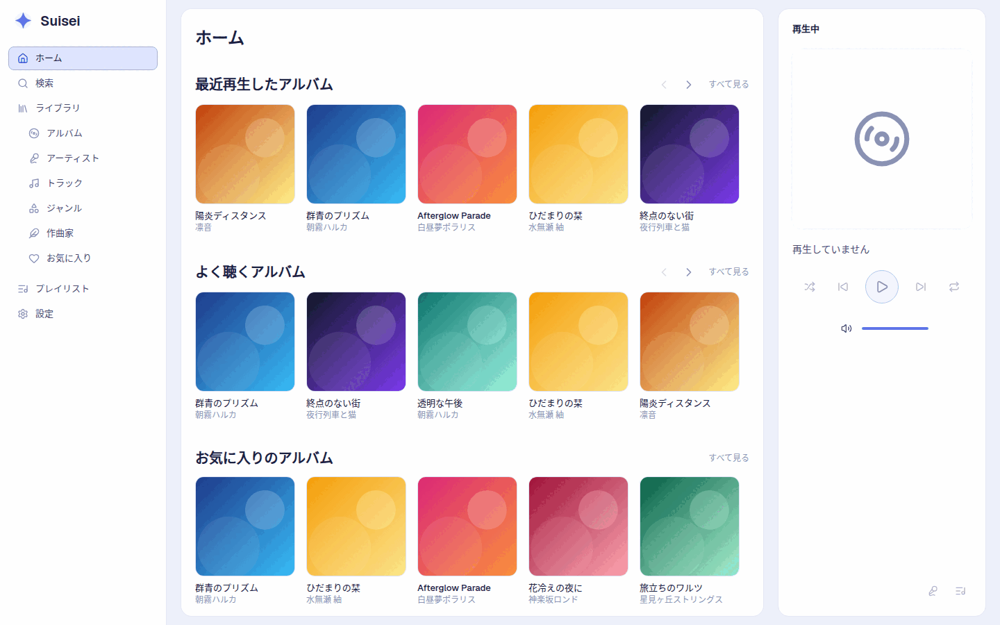
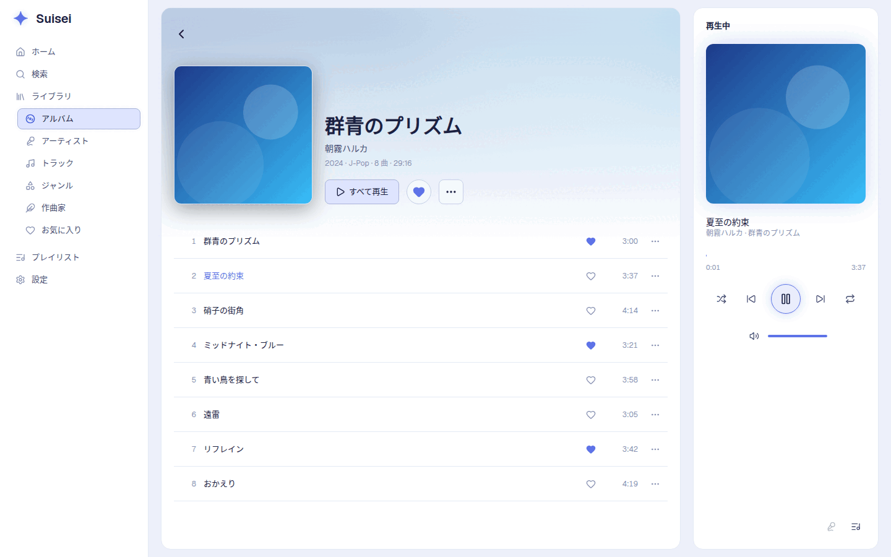
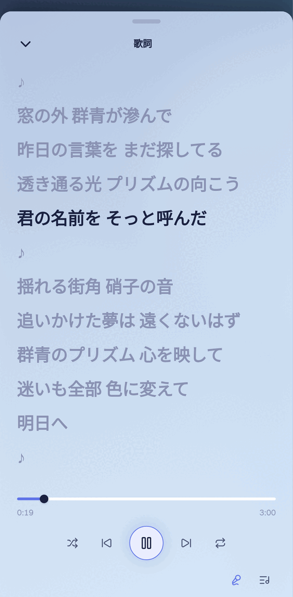

# Suisei

日本語の「読み」に強い、セルフホスト型の Subsonic / OpenSubsonic 互換音楽サーバー。

NAS やサーバー上の音楽ライブラリを読み込み、
同梱の Web クライアントや Symfonium などの Subsonic 対応クライアントから再生できます。

Suisei は特に、日本語の曲名・アルバム名・アーティスト名を含むライブラリを扱いやすくすることを重視しています。
漢字の読みを推定して五十音順に並べたり、読みから検索したりできます。

> [!NOTE]
> Suisei は個人利用を想定したシングルユーザー向けのサーバーです。

Suisei is a self-hosted music server compatible with Subsonic and OpenSubsonic, with a built-in web client.
It is built for libraries with Japanese titles and artist names: it infers readings for kanji names and sorts and searches by them.
It is designed for a single user. The documentation is written in Japanese.



## 主な特徴

### 日本語の「読み」で整理・検索

漢字を含む曲名、アルバム名、アーティスト名から読みを推定し、五十音順で並べます。

たとえば、曲名が `朝霧` なら `あさぎり` と検索して見つけることができます。

タグにソート用のかな・ローマ字表記が含まれている場合は、推定結果よりタグの値を優先します。

### 日本の音楽ライブラリを意識したタグ処理

一般的な音楽タグに加えて、日本のアニメ・ゲーム・キャラクターソングなどで見かける形式も扱います。

- `キャラクター(CV:声優)` 形式のアーティスト名をキャラクター名と声優名に分離
- 作詞・作曲・編曲などの役割を認識
- Shift_JIS で保存された `.lrc` 歌詞を読み込み
- タイムスタンプ付き歌詞の同期表示

### Web クライアントを内蔵

サーバー単体で Web クライアントを提供するため、別途フロントエンドを用意する必要はありません。

PC・スマートフォンの両方に対応し、以下の機能を備えています。

- 再生キュー
- プレイリスト
- お気に入り
- ライト / ダークテーマ
- タイムスタンプ付き歌詞の同期表示





### Subsonic / OpenSubsonic 対応

Subsonic API を通じて、対応する外部クライアントからライブラリを利用できます。

動作確認済みのクライアントは [対応クライアント](#対応クライアント) を参照してください。

### ffmpeg によるトランスコード

音源を MP3 や Opus に変換して配信できます。

自宅ではオリジナル音源、外出先では低ビットレートへ変換するといった使い方ができます。

### 対応フォーマット

以下の音声形式を読み込めます。

AAC / AIFF / APE / FLAC / M4A / MP3 / Musepack / Ogg / Opus / WAV / WavPack

## セットアップ

### 必要なもの

- Docker
- Docker Compose
- 音楽ファイルを保存したディレクトリ

ビルド済みの Docker イメージを GitHub Container Registry（`ghcr.io/inaba-garnet/suisei`）で配布しています。

### 1. compose.yaml を取得

任意のディレクトリに [`compose.yaml`](compose.yaml) を置きます。

```sh
mkdir suisei
cd suisei
curl -O https://raw.githubusercontent.com/inaba-garnet/Suisei/main/compose.yaml
```

### 2. ユーザー名とパスワードを設定

同じディレクトリに `.env` を作成します。

```sh
cat > .env <<'EOF'
SUISEI_USER=yourname
SUISEI_PASSWORD=長くて推測されにくいパスワード
EOF
```

### 3. 音楽フォルダを指定

`compose.yaml` 内の `/path/to/music` を、実際の音楽フォルダへ変更します。

### 4. 起動

```sh
docker compose up -d
```

起動後、ブラウザから次の URL を開きます。

```text
http://<サーバーのアドレス>:4533/
```

Subsonic クライアントを使用する場合も、同じサーバー URL と `.env` で設定したユーザー名・パスワードを指定します。

起動時に音楽フォルダをスキャンし、デフォルトではその後 1 時間ごとに再スキャンします。

### 更新

`compose.yaml` は `0.1` のように系列を指定しているので、同じ系列の修正版を取り込めます。

```sh
docker compose pull
docker compose up -d
```

リポジトリを取得してローカルでビルドする場合は、`compose.yaml` の `image:` の行を `build: .` に置き換えます。

## 設定

環境変数で動作を変更できます。

| 環境変数 | デフォルト | 説明 |
| --- | --- | --- |
| `SUISEI_USER` | 必須 | ログインに使用するユーザー名 |
| `SUISEI_PASSWORD` | 必須 | ログインに使用するパスワード |
| `SUISEI_API_KEY` | 未設定 | 設定した場合のみ OpenSubsonic の apiKey 認証を有効化 |
| `SUISEI_MUSIC_DIR` | Docker: `/music` | 音楽ライブラリのディレクトリ。読み取り専用で利用可能 |
| `SUISEI_DATA_DIR` | Docker: `/data` | データベースとキャッシュの保存先 |
| `SUISEI_LISTEN` | `0.0.0.0:4533` | HTTP サーバーの待受アドレス |
| `SUISEI_FFMPEG` | `ffmpeg` | トランスコードに使用する ffmpeg のパス |
| `SUISEI_TRUST_FORWARDED_FOR` | `false` | 信頼できるリバースプロキシの背後で利用する場合のみ `true` |
| `SUISEI_BACKUP_DIR` | `SUISEI_DATA_DIR` の下の `backup` | データベースのバックアップの保存先 |

Docker イメージ内には ffmpeg が含まれています。

次の項目は、Web クライアントの設定の画面で変更します。
変更はサーバーを起動し直さずに反映されます。

| 項目 | デフォルト | 説明 |
| --- | --- | --- |
| スキャンの間隔 | 1 時間 | ライブラリの再スキャンの間隔。止めると起動時のみ |
| バックアップの間隔 | 1 日 | データベースの定期的なバックアップの間隔。止めると定期的なバックアップを停止 |
| バックアップの世代数 | 7 | 残す定期的なバックアップの数 |
| CV の分割 | 分ける | `キャラクター(CV:声優)` 形式をキャラクター名と声優名に分離するか |
| Spotify の Client ID | 未設定 | 設定した場合のみ Spotify 連携を有効化 |

v0.1.0 で `SUISEI_SCAN_INTERVAL`、`SUISEI_BACKUP_INTERVAL`、`SUISEI_BACKUP_KEEP`、`SUISEI_SPLIT_CHARACTERS` を設定していた場合、これらの環境変数は効かなくなります。
設定の画面で同じ値を設定し直してください。

## バックアップ

お気に入り、評価、プレイリスト、再生回数はデータベースにのみ保存され、音楽フォルダから作り直せません。
Suisei はデータベースを定期的に `SUISEI_BACKUP_DIR` へ書き出します。

- `suisei-<日時>.db`：定期的なバックアップ。デフォルトでは 1 日ごとに作成し、7 世代を残します。
- `suisei-pre-migrate-<版>-<日時>.db`：更新でデータベースの形式が変わるときに、変換の直前に作成します。直近の 3 つを残します。定期的なバックアップを停止しても作成します。

日時は UTC です。

デフォルトの保存先はデータベースと同じディスクにあるため、ディスクの故障には備えられません。
NAS のバックアップ機能などで、`backup` ディレクトリを別のディスクや外部へ複製してください。

### 復元

Docker の例です。
`./data` は `compose.yaml` で `/data` にマウントしたディレクトリです。

```sh
docker compose stop
mkdir -p data/replaced
mv data/suisei.db data/suisei.db-wal data/suisei.db-shm data/replaced/ 2>/dev/null
cp data/backup/suisei-20261005T000000Z.db data/suisei.db
docker compose start
```

`suisei.db-wal` と `suisei.db-shm` は、復元するファイルと組み合わせると壊れるおそれがあるため、必ず退避します。
動作を確かめたら `data/replaced` を削除できます。

古い版のイメージへ戻す場合は、`suisei-pre-migrate-` のバックアップを復元してから、`compose.yaml` の `image:` を元の版にします。

## 対応クライアント

以下のクライアントで動作を確認しています。

- [Symfonium](https://symfonium.app/) — Android
- substreamer — Android / iOS
- Nautiline — iOS
- [Amperfy](https://github.com/BLeeEZ/amperfy) — iOS

## 現在の制約

Suisei は、汎用的なマルチユーザー音楽サーバーではなく、個人の音楽ライブラリをシンプルに扱うことを目的としています。

そのため、以下の制約があります。

- シングルユーザーのみ
  - ユーザー名とパスワードは一組のみ設定できます。
  - ユーザー管理や複数ユーザーには対応していません。
- 音楽フォルダは一つのみ指定できます。
- Subsonic API の一部は未実装です。
  - `getRandomSongs` など
  - クライアントによってはシャッフル再生やおまかせ再生が利用できない場合があります。
- 以下の機能は対象外です。
  - ポッドキャスト
  - 共有
  - ジュークボックス
  - インターネットラジオ
  - 動画
- アーティスト画像や紹介文など、外部サービスから取得するメタデータは提供しません。

## セキュリティ

Suisei を外部ネットワークから利用する場合は、特に以下を推奨します。

- 長く、推測されにくいパスワードを使用してください。
- インターネットへ直接公開せず、VPN 内で利用することを推奨します。
- 外部から接続する場合は、VPN または HTTPS 対応のリバースプロキシを使用してください。
- Subsonic クライアントで選択できる場合は、パスワードそのものを送信する `p` 認証ではなく、`t` と `s` を使用するトークン認証を推奨します。
- `SUISEI_API_KEY` は、apiKey 認証を必要とするクライアントを使用する場合のみ設定してください。

Suisei 自体は TLS を提供しません。

また、Subsonic API では認証情報やトークンが URL に含まれる場合があります。平文 HTTP でインターネットを経由させないでください。

### ログイン試行制限

同一の送信元から 15 分以内に 11 回ログインに失敗すると、その送信元からのアクセスを 15 分間拒否します。

ただし、複数の送信元から少数ずつ試行される分散型の総当たり攻撃を防ぐものではありません。

### リバースプロキシを使用する場合

信頼できるリバースプロキシの背後に配置する場合は、以下を設定します。

```sh
SUISEI_TRUST_FORWARDED_FOR=true
```

これを設定しない場合、Suisei からはすべてのアクセスがリバースプロキシと同じ IP アドレスから来ているように見えます。そのため、一人のログイン失敗によって他の利用者まで一時的に拒否される可能性があります。

一方、リバースプロキシを使用していない環境では `true` にしないでください。クライアントが送信元 IP アドレスを示すヘッダーを偽装し、試行制限を回避できるようになります。

## 開発

バックエンドは Rust、Web クライアントは Nuxt で実装しています。

```text
Suisei/
├── server/   # Rust サーバー
├── web/      # Nuxt Web クライアント
└── docs/     # 設計資料
```

技術選定や実装方針については [`docs/`](docs/) を参照してください。

- サーバー: [`docs/server.md`](docs/server.md)
- データベース・日本語読み処理: [`docs/schema.md`](docs/schema.md)
- Web クライアント: [`docs/web.md`](docs/web.md)
- 開発・コミット・ブランチ運用: [`AGENTS.md`](AGENTS.md)

## ライセンス

Suisei は [MIT License](LICENSE) のもとで公開しています。

依存ライブラリなどのライセンスについては以下を参照してください。

- サーバー: [`server/THIRD_PARTY_LICENSES.md`](server/THIRD_PARTY_LICENSES.md)
- Web クライアント: [`web/THIRD_PARTY_LICENSES.md`](web/THIRD_PARTY_LICENSES.md)
- 日本語読み辞書: [`server/dict/README.md`](server/dict/README.md)

読み辞書の一部は日本語版 Wikipedia の記事名をもとに生成しており、該当部分には CC BY-SA 4.0 が適用されます。

Docker イメージには ffmpeg（GPL）が独立したプログラムとして含まれます。

README 内のスクリーンショットに表示されているアーティスト名、アルバム名、曲名、歌詞はすべて架空のものです。
