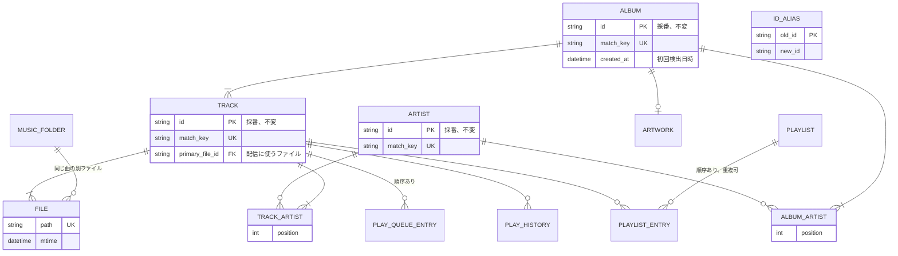

# DB スキーマ

設計判断とその理由だけを書く。列の一覧はマイグレーションを正とする。

## 利用者
- 一人で使う前提。ユーザーのテーブルは持たず、認証情報は環境変数か起動引数で渡す。
- お気に入り、評価、再生キューは各エンティティや一行のテーブルに直接持つ。

## ID と同一判定
- ID は初回検出時に採番し、変えない。タグを直してもお気に入りやプレイリストを失わないため。
- 同じ曲かどうかは `match_key` で判定する。鍵は NFKC 正規化、大文字小文字の統一、空白の整理をしたタグから作る。
  - TRACK: タイトル、アーティスト、アルバム、ディスク番号、トラック番号
  - ALBUM: アルバム名、アルバムアーティスト
  - ARTIST: 名前
- 鍵が一致したものは自動でマージする。タグ修正で別の曲と鍵が一致した場合も同じ。
- 鍵が違うものは手動でマージする。消える側の ID は `ID_ALIAS` に残し、クライアントが保存した古い ID にも応答する。
- タグ修正後は `FILE.path` から元の TRACK を探し、`match_key` だけを更新する。

## アーティスト
- 曲とアルバムのアーティストは多対多で、表示順を持つ。OpenSubsonic の `artists` と `albumArtists` に応えるため。

## 配信ファイル
- 一曲に複数ファイルがあれば、スキャン時に `primary_file_id` を決める。可逆圧縮を優先し、同じ形式どうしはビットレートが高いほう。
- モバイル向けの低ビットレート配信は、このファイルをエンコーダに通して行う。
