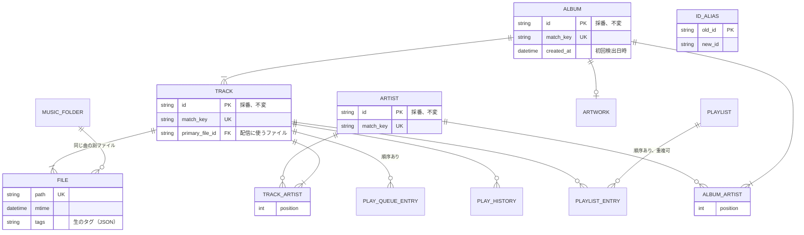

# DB スキーマ

設計判断とその理由だけを書く。列の一覧はマイグレーションを正とする。

## 利用者
- 一人で使う前提。ユーザーのテーブルは持たず、認証情報は環境変数か起動引数で渡す。
- お気に入り、評価、再生キューは各エンティティや一行のテーブルに直接持つ。

## ID と同一判定
- ID は初回検出時に採番し、変えない。タグを直してもお気に入りやプレイリストを失わないため。
- ID は種類の接頭辞（`ar-`、`al-`、`tr-`、`fi-`）と、16 進 8 文字の乱数をつなげる。`getCoverArt` にはアルバムと曲のどちらの ID も来るので、種類をまたいで一意にする。重複は、スキャンの初めに読み込んだ既存の ID（別名を含む）と照らして採り直す。DB に ID を書き込むのはスキャンだけなので、一意制約の違反を待つのと同じ結果になり、トランザクションをやり直さずに済む。
- 同じ曲かどうかは `match_key` で判定する。鍵は NFKC 正規化、大文字小文字の統一、空白の整理をしたタグから作る。
  - TRACK: タイトル、アーティスト、アルバム、ディスク番号、トラック番号
    - アーティストは、表示用の文字列ではなく一人ずつの名前を並べて使う。`A feat. B` のような連結の表記が違っても、同じ曲にするため。
  - ALBUM: アルバム名、アルバムアーティスト
  - ARTIST: 名前
- 鍵が一致したものは自動でマージする。タグ修正で別の曲と鍵が一致した場合も同じ。
- 鍵が違うものは手動でマージする。
- マージで消える側の ID は、自動でも手動でも `ID_ALIAS` に残し、クライアントが保存した古い ID にも応答する。
- タグ修正で鍵が変わったものは、前回同じファイルが属していた ID を引き継ぐ。アルバムとアーティストは、同じ曲の同じ位置にいた ID を引き継ぐ。その ID をほかがまだ使っているとき（二つのファイルの片方だけ直したときなど）は、新しく採番する。

## アーティスト
- 曲とアルバムのアーティストは多対多で、表示順を持つ。OpenSubsonic の `artists` と `albumArtists` に応えるため。
- 曲とアルバムには、表示用の文字列（`ARTIST`、`ALBUMARTIST`）を別に持ち、`displayArtist` として返す。`ARTIST` がなければ `ARTISTS` を使う。複数値は ` / ` でつなぐ。
- 曲のアーティストは `ARTISTS` から作り、なければ `ARTIST` の値を分割せずに一人ずつ使う。名前に区切りの文字を含むアーティストがいるため。
- アルバムのアーティストは `ALBUMARTISTS` から作る。なければ MusicBrainz のアルバムアーティスト ID を曲のアーティスト ID と対応させ、対応する `ARTISTS` の名前を使う。対応しなければ、`ALBUMARTIST` が曲の `ARTIST` と同じときは曲の `ARTISTS` を、違うときは `ALBUMARTIST` を一人として使う。
- 同じアーティストかは名前の `match_key` だけで判定する。MusicBrainz の ID は、付いていないファイルと混ざると同じ人が分かれるので使わない。
- 表記ゆれでまとまったアーティストの表示名は、最も多くのファイルで使われている表記にする。同数なら先に見つかった表記。
- `キャラクター(CV:声優)` の形の名前は、キャラクターと声優の二人に分ける。声優の名前で他の曲とつながるように。
  - 括弧の全角半角、`CV` の大文字小文字と全角、`CV` の後の `.`、`:` と空白の有無を問わない。
  - `A(CV:x)、B(CV:y)` のような列挙は、区切り（`、`、`,`、`&`、`・`、`/`、`×`、空白）で切った断片がすべてこの形のときだけ分ける。末尾の `他` は捨てる。
  - `ユニット [A(CV:x)、B(CV:y)]` のようにユニット名に続くもの（括弧は `[]`、`《》`、`()`、`【】`、または `:`、`/` で続ける）は、ユニットも一人として残す。
  - 並びはユニット、キャラクター、声優の順。同じ名前が重なったら先のものを残す。
  - 声優を一つの括弧にまとめて書いたもの（`A・B(CV:x、y)`、`A×B(CV:x×y)`）、`feat.` を含むもの、形の崩れたものは分けない。キャラクターと声優の対応を誤るより、一人のままのほうがよいため。
  - `CV` が括弧の中で始まるときだけ分ける。`C.V. Jørgensen` のように名前に CV を含むアーティストがいるため。
  - `Vo.` は分けない。ユニットとボーカルの組など、意味が違うため。
  - 分けた名前には、ソート用タグの値を付けない。
  - 表示用の文字列（`displayArtist`）はタグのまま返す。
  - 既定で分け、`SUISEI_SPLIT_CHARACTERS=false` で分けないようにできる。タグの付け方によっては、一人のままのほうが扱いやすいため。
  - 切り替えると、次のスキャンで分けた名前と分けない名前が入れ替わる。アーティストの ID は同じ曲の同じ位置のものを引き継ぐので、お気に入りや評価が別のアーティストに移ることがある。
- タグがまったくないファイルは `[Unknown Artist]` のアーティストにする。
- アーティストのアルバム（`getArtist`）には、アルバムアーティストのアルバムに、曲で参加しているアルバムを足す。曲にだけ参加しているアーティストを開いても空にならないようにするため。このため、一覧（`getArtists`）の `albumCount` より多くなることがある。

## タグの欠落
- タイトルがなければ、拡張子を除いたファイル名にする。
- アルバム名がなければ、ファイルのあるフォルダの名前にする。フォルダがアルバムの単位になっていることが多いため。音楽フォルダの直下にあるファイルは `[Unknown Album]` にする。

## アルバム
- アルバムの名前の表記、表示用アーティスト、ソート用タグは、属するファイルの多数決で決める。同じ鍵のアルバムでも、全角半角などの表記はファイルごとに違いうるため。
- 年は属するファイルの最も新しい年にする。再発盤の曲が混ざっても、アルバムの年が古い値に戻らないように。
- アルバムのジャンルは、属する曲のジャンルを曲数の多い順に並べたもの。
- 曲の初回検出の日時を持ち、Subsonic の `created` として返す。

## ジャンル
- 曲とジャンルは多対多で、タグに書かれた順を持つ。
- `GENRE` の値は `/`、`,`、`;` で分けて、別々のジャンルにする。`J-POP/General` のような値は、複数のジャンルを一つの値につないだものと考えるため。ID3v2.3 は複数値を持てず、書き込み側が `/` でつなぐ。
- 同じジャンルかは `match_key` と同じ正規化で判定する。一つの曲で重なったものは先のものを残す。
- 表記ゆれでまとまったジャンルの表示名は、最も多くのファイルで使われている表記にする。同数なら先に見つかった表記。
- 空のジャンルは捨てる。
- `getAlbumList2` の `byGenre` は、受け取った `genre` を同じ正規化で照らす。クライアントが別の表記で求めても見つかるように。

## カバーアート
- アルバムごとに一枚にし、スキャンで元を決めて記録する。曲には属するアルバムの画像を使う。
- 元は、アルバムのファイルがあるフォルダの画像（`cover.*`、`folder.*`、`front.*` の順、大文字小文字を区別しない）、なければ画像を埋め込んだ最初のファイル。Navidrome の既定と同じ順にする。
- 画像のないアルバムと曲の応答には `coverArt` を付けない。付けると、クライアントが取りに来ては失敗するため。
- `size` を付けて求められたら、縦横比を保って長いほうの辺を `size` に縮め、JPEG（品質 85）で返す。容量を小さくするため、透過は白で塗りつぶす。
- `size` がなければ 1024 を上限にする。`size` を付けないクライアントにも、数 MB の元画像を送らないため。
- 元の画像が `size` 以下なら、拡大せずに元の画像を返す。
- 縮小した JPEG が元のファイルより大きければ、元の画像を返す。強く圧縮された元画像を品質 85 で作り直すと、画素が減っても容量が増えることがあるため。
- 縮小した画像（元の画像を返すと決めたものは元の画像）は、データの置き場所の下の `cache/cover/` に保存して使い回す。一覧の画面は数十枚を一度に求めるので、毎回縮小すると NAS の CPU では重いため。
- キャッシュのキーはアルバム、`size`、元のファイルの更新日時にする。画像を差し替えたら新しく作り、同じアルバムと `size` の古いファイルは消す。
- 同時に縮小するのは CPU の数までにする。一斉に求められても、メモリと CPU が跳ね上がらないようにするため。

## 歌詞
- 音声と同じ名前の `.lrc` と、埋め込みの歌詞（ID3v2 の `USLT` と `SYLT`、Vorbis の `LYRICS` と `UNSYNCEDLYRICS`、MP4 の `©lyr`）を読む。
- スキャンでは読まず、求められたときにその曲のファイルを読む。保存するタグの版を上げると全ファイルを読み直すことになるが、歌詞は一曲の再生に一度しか求められないため。
- 見つかった歌詞はすべて返し、時刻付きを先に並べる。どれを表示するかはクライアントに任せる。
- 本文と時刻が同じ歌詞は一つにまとめる。言語だけ違う `USLT` を二つ埋め込んだ MP3 があり、同じ歌詞が二つ並ぶため。
- 本文に `[mm:ss.xx]` の時刻があれば、埋め込みでも時刻付きとして読む。
- `.lrc` は UTF-8 で読めなければ Shift_JIS で読む。日本語の `.lrc` には Shift_JIS のものが多いため。
- 言語はタグのコードをそのまま返し、ないものは `und` にする。`USLT` には日本語でも `eng` と書かれたものが多いが、正しい言語を推す手がかりがないので直さない。

## 配信ファイル
- 一曲に複数ファイルがあれば、スキャン時に `primary_file_id` を決める。可逆圧縮を優先し、同じ形式どうしはビットレートが高いほう。
- モバイル向けの低ビットレート配信は、このファイルをエンコーダに通して行う。
- `stream` に `maxBitRate` も `format` もなければ、変換せずに元のファイルを返す。`format=raw` も同じ。
- `format` が `mp3` か `opus` なら、その形式に変換する。`maxBitRate` がなければ 320 kbps にする。
- `maxBitRate` だけなら MP3 に変換する。どの端末でも再生できるため。
- ビットレートの上限は 320 kbps にする。元のファイルが非可逆圧縮なら、元のビットレートより上げない。
- 元のファイルが求められた形式で、ビットレートも上限以下なら、変換せずに元のファイルを返す。
- 変換した音声は長さが事前に分からず Range で途中から読めないので、OpenSubsonic の `transcodeOffset` を公開し、`timeOffset`（秒）から変換する。
- `estimateContentLength=true` なら、長さとビットレートから見積もった `Content-Length` を付ける。
- 変換した結果はキャッシュせず、求められるたびに変換する。

## 日本語の並べ替え
- 曲、アルバム、アーティストに読みを持ち、OpenSubsonic の `sortName` として返す。クライアント側の並べ替えも五十音順にするため。
- 読みは手動設定、ソート用タグ、形態素解析の推定、元の名前の順で採る。どこから得たかも記録し、再スキャンで手動設定を消さない。
- ソート用タグが漢字を含めば、読みとして使わない。名前をそのまま書いたタグがあるため。
- ソート用タグがかなを含めば、かなをカタカナにそろえて読みにする。英字、数字、記号はそのまま残す。`えいけつのGemini` のように、かなと混ぜた英字は英語や略語として書かれていることが多く、ローマ字として読むと `ゲミニ` のように誤るため。
- ソート用タグがかなを含まずローマ字で、名前に日本語を含むときは、カタカナに変換して読みにする。L は R として読み、長音記号は展開する。「姓, 名」形式の `,` と、`Kuma-san` のような `-` は消す。`-` は区切りとして書かれることが多く、長音記号にすると読みを誤るため。ローマ字として読み切れない部分（英語など）が残れば使わない。
- 元の名前は、かなと記号だけのときに限り読みにする。数字は記号に含めない。`4U` のような名前をかなの読みとして扱わないため。
- 読みがなければ `sortName` を返さない。
- アーティストのソート用タグは、アーティストが一人だけのファイルの値を、表示名と同じく多数派で採る。
- 長音の省略（`Kojo`）や助詞（`e`、`wa`）は変換で直せないので、手動設定か形態素解析で直す。
- 読みはカタカナにそろえ、JIS X 4061 に従って並べる。文字の種類は記号、数字、英字、かな、読みのない名前の順で、読み（なければ名前）の最初の文字で決める。
  - 一次の比較では、記号と空白を除き、濁点、半濁点、アクセントを外し、小書きを大きくし、長音記号を直前の母音に置き換え、英字の大文字小文字を区別しない。同じなら元の文字列で比べる。
  - 数字は文字列として比べる（`10` が `9` より前）。数値として比べる実装の手間に対して、名前で困る場面が少ないため。
  - 読みのない漢字の名前は、五十音の行に入れられないので、かなの後ろにコードポイントの順で並べる。
- 並べ替えのキーは、文字の種類、一次の比較の文字列、元の文字列をつないだ文字列にし、バイト列の順に並べる。
- アーティスト一覧の見出しは `#`（記号と数字）、`A`〜`Z`、五十音の行（あ、か、さ…）、`他`（読みのない名前）の順にまとめる。
- アーティスト一覧（`getArtists`、`getIndexes`）には、アルバムアーティストになっているアーティストだけを載せる。曲にだけ参加しているアーティストまで載せると、アルバムが 0 枚のアーティストが一覧に並ぶため。
- 冠詞（`The` など）を飛ばして並べる規則は持たない。日本語の名前が中心のライブラリでは効き目が薄いため。
- 読みは Web クライアントから手動で直せるようにする。
- 漢字を含む名前は、ソート用タグと元の名前から読みが得られなければ、形態素解析で推定する。人名や作品名のように辞書にない語は読み違えるので、ソート用タグより後に採る。
  - 空白で区切った語ごとに解析し、読みを空白でつなぐ。
  - 英字や数字など辞書に読みのない部分は、そのまま残す。`NHK` のように辞書に読みのある英字は、読みに変わる。並べ替えは最初の文字で決まるので、`歌物語 Special Edition` は `ウタモノガタリ Special Edition` として五十音の行に入る。
  - 読めない漢字が一つでも残れば、推定しない。漢字の混ざった読みは、五十音の行にもコードポイントの順にも正しく並ばないため。
  - どこから得たかは `estimated` として記録する。

## 検索
- 検索語と照らす文字列は、`match_key` と同じ正規化に加え、ひらがなをカタカナにそろえる。読みで探せるようにするため。
- 空白で区切った語は、すべてを含むものだけを返す。
- 照らす先は、アーティストが名前と読み、アルバムが名前と読みと表示用アーティストとアルバムアーティストの読み、曲が曲名と読みと表示用アーティストとアルバム名と曲のアーティストの読み。
- 照らす文字列はスキャンで作って列に保存し、部分一致（`LIKE`）で全行を順に見る。数万曲なら十分に速く、足りなくなったら全文検索に替える。
- 検索のアーティストには、曲にだけ参加しているアーティストも含める。CV の声優や feat. の相手も名前で探せるようにするため。
- 空の検索語（`""` を含む）は全件を返す。Symfonium と substreamer が全件の同期にこれを使うため。

## お気に入りと評価
- 曲、アルバム、アーティストの行に、お気に入りにした日時と評価（1〜5）を持つ。スキャンはこの列を書かないので、再スキャンで消えない。
- 曲がマージで消えるときは、お気に入りの日時は古いほうを、評価は残る側の値を優先して引き継ぐ。評価はどちらが正しいか決める手がかりがないので、ID を引き継ぐ側に合わせる。アルバムとアーティストも同じ。
- 知らない ID は飛ばして成功を返す。オフラインで溜めた操作をクライアントが再送し続けないようにするため。
- お気に入りにし直しても日時は変えない。
- `getAlbumList2` の `starred` はお気に入りにした新しい順、`highest` は評価の高い順（同じなら再生回数の多い順）にし、どちらも該当しないアルバムは含めない。
- `getStarred`（v1）は、アルバムを `Child` の形にする変換を `getAlbumList`（v1）と共有するので、#26 で実装する。

## プレイリスト
- プレイリストと、その曲の並び（位置と曲）を別の表に持つ。同じ曲を何度でも入れられるよう、位置を主キーに含める。
- ID は種類の接頭辞 `pl-` と 16 進 8 文字の乱数。
- ファイルが消えた曲はプレイリストから除き、マージで消える曲はその位置のまま残る曲に付け替える。
- `updatePlaylist` の `songIndexToRemove` は 0 始まりの位置とし、削除を先に、`songIdToAdd` の追加を後に行う。仕様に定めがないので、クライアントが動作を確かめていることの多い Navidrome に合わせる。
- 知らない曲の ID は飛ばして残りを入れる。
- `coverArt` は、画像のある最初の曲のアルバムの ID にする。プレイリスト専用の画像は作らない。
- 音楽フォルダの `.m3u` はスキャンで取り込まない。取り込みと出力は Web クライアントから行う（#30）。

## 再生履歴
- 再生を一回ごとに一行（曲と再生時刻）で持ち、再生回数と最後に再生した日時は問い合わせのたびに集計する。一人の履歴なら索引で足り、期間を絞った集計もあとから作れるため。
- 再生時刻は `scrobble` の `time` を使い、なければ受け取った時刻にする。Symfonium は `time` を付けない。
- 同じ曲と同じ時刻の組は一度だけ記録する。オフラインで溜めた再生をクライアントが再送しても、回数を増やさないため。
- 知らない ID は飛ばして残りを記録し、成功を返す。エラーにすると、消えた曲を含む再生の束をクライアントが再送し続けるおそれがあるため。
- 曲がマージで消えるときは、履歴を残る側の ID へ付け替える。タグを直して二つの曲が一つになっても、再生回数を失わないため。
- アルバムの再生回数と最後に再生した日時は、属する曲の履歴を合わせたもの。
- `getAlbumList2` の `recent` は最後に再生した順、`frequent` は再生回数の多い順にし、再生したことのないアルバムは含めない。
- `getTopSongs` は、そのアーティストの曲を再生回数の多い順に、再生したものだけ返す。外部の情報源を使わないため。
- 再生中の曲（`submission=false`）は DB に持たず、メモリにクライアントごとの最後の一曲を持って `getNowPlaying` で返す。数分しか意味のない情報で、再起動で消えても困らないため。曲の長さを過ぎたものと、再生を終えた（`submission=true` が来た）ものは返さない。

## スキャン
- 定期実行と手動実行にする。Docker で NAS をマウントすると、ファイル変更の通知（inotify）が届かないことがあるため。
- 定期実行の間隔は、前のスキャンが終わってから数える。スキャンを重ねないため。手動のスキャンが走っていれば、定期実行のその回は飛ばす。
- 全ファイルを見つけてから、消えたファイルと新しいファイルを突き合わせ、残りを削除する。移動を削除と新規に分けて ID を失わないため。
- 移動は `match_key` で追跡する。移動と同時にタグを直した場合は、削除と新規として扱う。
- ファイルごとに生のタグを JSON で保存し、曲、アルバム、アーティストはスキャンのたびに保存したタグから組み立て直す。変わっていないファイルを読み直さずに、表記の多数決を数え直すため。タグから内部のモデルを作る規則を変えたときも、次のスキャンで反映される。
- 保存するタグには版を持たせ、タグから読む項目を足したら版を上げる。古い版で保存したファイルは、変わっていなくても次のスキャンで読み直す。
- サイズと mtime が前回と同じファイルは読み直さない。NAS 上で全ファイルを毎回開くと遅いため。mtime を変えずにタグを書き換えた場合に備え、`startScan` に `fullScan=true`（Navidrome と同じ引数）を付けると全件を読み直す。
- 音楽フォルダが読めないとき、または音声が一つも見つからないのに DB にファイルがあるときは、何も消さずにスキャンを中断する。NAS のマウントが外れた瞬間にスキャンが走り、全曲とお気に入りやプレイリストを失うのを防ぐため。
- 読めないファイルとディレクトリは、DB の前回の行を残す。一時的に読めないだけのことがあるため。
- 音楽フォルダは一つだけ持ち、DB には音楽フォルダからの相対パスを保存する。NAS のマウント先が変わっても ID を保つため。
- 隠しファイルと隠しディレクトリは読まず、シンボリックリンクはたどらない。
- ファイルが消えた曲はライブラリから消し、プレイリスト、お気に入り、再生履歴からも除く。
